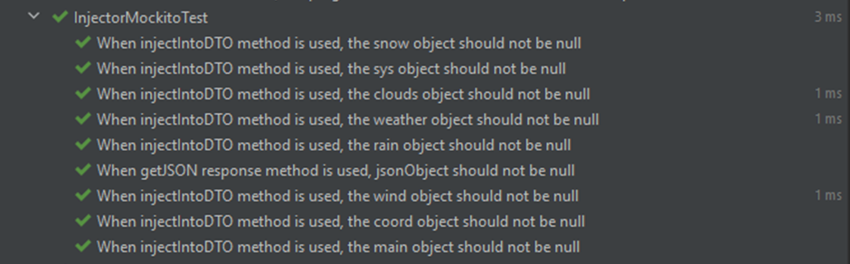

# Weather API Application (Java)
> Developed By:
>
> • Sami Zirak - Junior Java SDET Consultant | [Portfolio](https://samiz.dev/) | [GitHub](https://github.com/samizirakgamedev) | [LinkedIn](https://www.linkedin.com/in/sami-zirak-dezfouly/) | [Twitter](https://twitter.com/SamiZirakDev) |
>
> • Piotr Sulek - Junior Java SDET Consultant | [GitHub](https://github.com/piotr02) | [LinkedIn](https://www.linkedin.com/in/piotr-sulek/) |
>
> • Álvaro González - Junior Java SDET Consultant | [GitHub](https://github.com/Alvaropz) | [LinkedIn](https://www.linkedin.com/in/alvaropzgz/) |
>
> • Mihai Udrea - Junior Java SDET Consultant | [GitHub](https://github.com/udreamihai) | [LinkedIn](https://www.linkedin.com/in/mihai-udrea-307885b7/) |
>
> • Sajad Gulzar - Junior Java SDET Consultant | [GitHub](https://github.com/SajadGulzar) | [LinkedIn](https://www.linkedin.com/in/sajad-gulzar-322788156/) |
>
> • Gideon Troy - Junior Java SDET Consultant | [GitHub](https://github.com/Gideon9876543) | [LinkedIn](https://www.linkedin.com/in/gideon-troy-424b10216/) |
>
A testing framework to test the [Open Weather Map API](https://openweathermap.org/current). This project is part of our ongoing training @ [Sparta Global](https://www.spartaglobal.com/).
### Table Of Contents ###
+ [Software & Dependencies](#software-&-dependencies)
+ [How To Use](#how-to-use)
+ [Project Scope](#project-scope)
+ [Project Management](#project-management)
+ [Testing Framework](#testing-framework)
+ [Outcomes and Future Work](#outcomes-and-future-work)
### Software & Dependencies ###
* **IntelliJ Community Edition** [Version 2021.3.2](https://www.jetbrains.com/idea/download/#section=windows)
* **JDK** [Version 17.0.2](https://jdk.java.net/17/)
* **Apache Maven**
    * **Note:** This dependency can be imported using IntelliJ.
    * _Go to **"File" > "New Project"** and then selecting **"Maven"** as the project structure._
* **JUnit Jupiter API** [Version 5.8.2](https://mvnrepository.com/artifact/org.junit.jupiter/junit-jupiter-api/5.8.2)
    * _**Note:** This dependency can be imported within Intellij using Apache Maven and IntelliJ's built-in dependency generator._
    * Alternatively you can open the Maven **"pom.xml"** file and paste in the following code within the **"dependencies"** section of the file:
```xml
    <dependency>
        <groupId>org.junit.jupiter</groupId>
        <artifactId>junit-jupiter</artifactId>
        <version>5.8.2</version>
    </dependency>
```
* **Mockito Core** [Version 4.3.1](https://mvnrepository.com/artifact/org.mockito/mockito-core/4.3.1)
    * _**Note:** This dependency can be imported within Intellij using Apache Maven and IntelliJ's built-in dependency generator._
    * Alternatively you can open the Maven **"pom.xml"** file and paste in the following code within the **"dependencies"** section of the file:
```xml
    <dependency>
        <groupId>org.mockito</groupId>
        <artifactId>mockito-core</artifactId>
        <version>4.3.1</version>
    </dependency> 
```
* **Cucumber JVM: Java** [Version 7.2.3](https://mvnrepository.com/artifact/io.cucumber/cucumber-java/7.2.3)
    * _**Note:** This dependency can be imported within Intellij using Apache Maven and IntelliJ's built-in dependency generator._
    * Alternatively you can open the Maven **"pom.xml"** file and paste in the following code within the **"dependencies"** section of the file:
```xml
    <dependency>
        <groupId>io.cucumber</groupId>
        <artifactId>cucumber-java</artifactId>
        <version>7.2.3</version>
    </dependency> 
```
* **Cucumber JVM: JUnit** [Version 7.2.3](https://mvnrepository.com/artifact/io.cucumber/cucumber-java/7.2.3)
  * _**Note:** This dependency can be imported within Intellij using Apache Maven and IntelliJ's built-in dependency generator._
  * Alternatively you can open the Maven **"pom.xml"** file and paste in the following code within the **"dependencies"** section of the file:
```xml
    <dependency>
        <groupId>io.cucumber</groupId>
        <artifactId>cucumber-junit</artifactId>
        <version>7.2.3</version>
    </dependency>
```
<br/>
<div align="right">
    <b><a href="#weather-api-application-java">↥ back to top</a></b>
</div>
<br/>

### How To Use ###

<br/>
<div align="right">
    <b><a href="#weather-api-application-java">↥ back to top</a></b>
</div>
<br/>

### Project Scope ### 
As the API has a number of different responses, we need to use a Service Object Model. This model represents the various API requests using the following components:
* **DTO**: Classes that represent the different types of responses that can be called.
* **ConnectionManager**: A class which handles the connection to the live system and collecting the response.
* **Injector**: A class responsible for injecting the JSON response into a weather DTO.
The DTOs should provide access to all the data that testers could find useful.

Along with providing the DTOs, we will also provide an example test bed showing examples of ALL the different types of test that can be performed. Include support for defining tests using Cucumber. The framework itself should also be internally tested using unit testing and mocking.

<br/>
<div align="right">
    <b><a href="#weather-api-application-java">↥ back to top</a></b>
</div>
<br/>

### Project Management ###
Throughout the project we made use of multiple project management tools including:

* GitHub, GitHub Desktop and Sourcetree for version control.
* Trello for sprint and task management.
* Microsoft Teams and Discord for collaborative working and meetings.
Bellow is a commit graph showing the commit history of the project:

COMMIT GRAPH TO BE ADDED 

We each branched off and worked on our separate tasks and would then merge together to update each of our branches with an up-to-date version of the project. On the last day of the project we branched off less and merged in more frequently to refactor,make final updates and fix bugs.

Our trello was also updated throughout our project to reflect the completion of deadlines and the completion of sprints and tests.

TRELLO TO BE ADDED

<br/>
<div align="right">
    <b><a href="#weather-api-application-java">↥ back to top</a></b>
</div>
<br/>

### Testing Framework ###

#### Mocking Using Mockito: ####
Mocking is used when you invoke methods of a class that has external communication like database calls or rest calls. 
Through Mocking you can explicitly define the return value of methods without actually executing the steps of the 
method. Mockito was the Mocking tool used in this project.
Mocking in this project was used to mock the Connection Manager so that the injector is checked, even if there is no 
actual connection. The results of the Mockito tests are shown below along with each corresponding test details:



#### JUnit Automatic Testing: ####

JUnit Testing is a series of automatic tests that can be designed in a method that is easy to understand, 
a third party user should also be able to create and use tests using the same format. In this project the classes that 
were tested are show below:
* APIKeyFileReader.
* ConnectionManager.
* Injector.
* DTO Classes.

Various tests were completed to establish each method with the classes listed above, works correctly. The details and 
evidence of each JUnit test are listed below:


#### Manual Testing: ####

There is effectively no manual testing needed due to the absence of a User Interface. The 'WeatherAPIMain' class/method 
is simply to check if you get a response from the API key and get that response as a string. Evidence that the method 
shows the response in the console is shown below:


#### Cucumber Testing: ####


<br/>
<div align="right">
    <b><a href="#weather-api-application-java">↥ back to top</a></b>
</div>
<br/>

### Outcomes and Future Work ###
The project provides a testing framework for the current weather API.
Testers can utilise its modularity to test various parts of the API, 
without having to create or expand the code as it already provides
ways to access all the relevant information. There are a lot of tests
included in the framework (user stories, JUnit, mock tests). These can
be applied in many general situations or used as a guide for creating
further tests.

Possible future expansions could include other APIs from the openweathermap.org
website such as One Call API or Solar Radiation API.
<br/>
<div align="right">
    <b><a href="#weather-api-application-java">↥ back to top</a></b>
</div>
<br/>